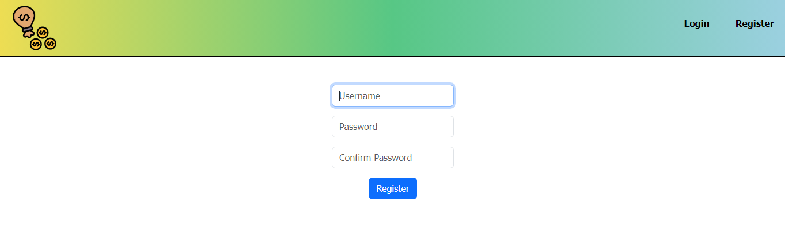
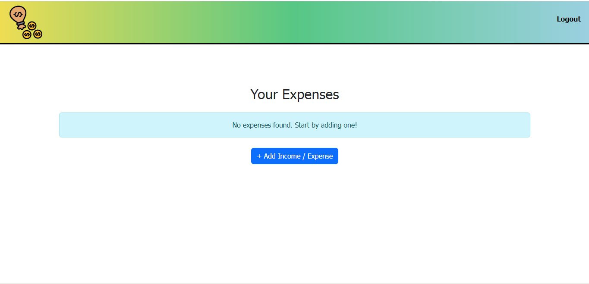
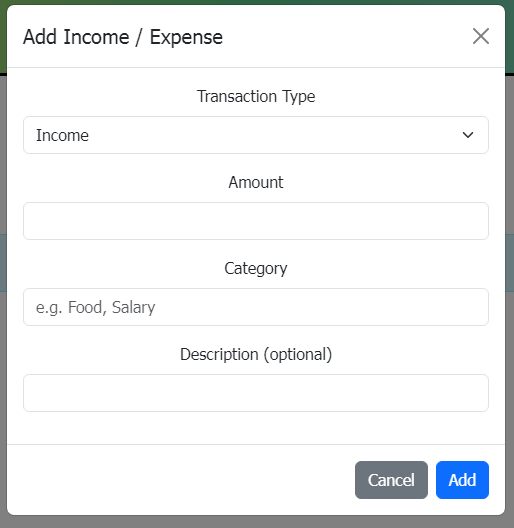
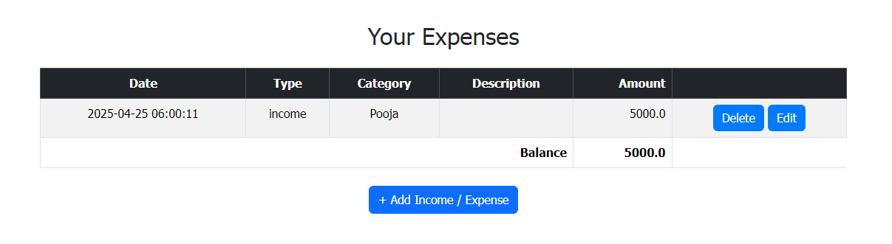
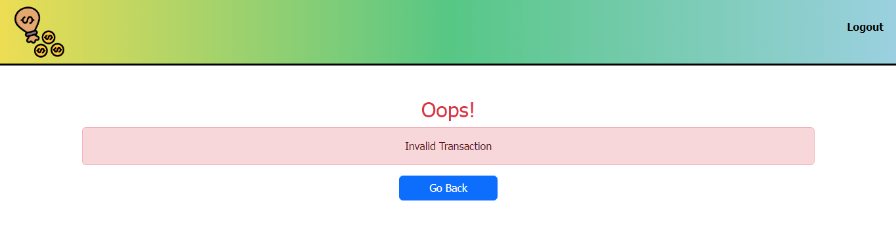

# Expense Tracker
## Cs50 Final Project

#### Video Demo: https://www.youtube.com/watch?v=UkB6dFuYGIA
Hey Everyone! I have made a web application using Python, JavaScript, jinja, Html and CSS. It is a basic web-app which can be used to track your day to day expenses.

Having trouble in maintaining my daily budget and  daily-expenses, inspired me to create an expense tracker. This project solves the real-world problem of keeping track of my expenses and planning my budget.

## **Features:**
#### 1. User Authentication:
* The application supports user registration and login, using a secure authentication system. Each user's data is stored independently, so multiple users can use the app simultaneously without interfering with each other's records.

* Registration involves creating a username and password.

* Passwords are securely hashed and stored in the database.

_To get started, you have to register in the web-app:_

#### 2. Index/ Dashboard:
* After logging, the user is taken to the manin dash board
* Here you will view the summary of all Financial records, such as:
    * Income or Expense
    * Entries with time and date
    * Category
    * Optional Description
    * Current Balance

_Index / Dashboard:_

 

 #### 3. Add Income/ Expense:
 * On clicking add income/ expense, a dialog box appears(model window).

 * This model window allows user to:
    * Choose between income or expense
    * Enter Amount
    * Optional Description
    * To submit click on add

 _Model Window:_

  

  #### 4. Edit / Delete:
  * If a user accidentally enters a wrong amount, category or type, you can easily delete or edit it.

  * Each entry has a seperate delete and edit button.

  _Dashboard with entries:_

  

  #### 5. Error Handling and Error Page:
  As part of building a complete and user-friendly web application, I also implemented custom error handling. While using any web app, users may sometimes make incorrect requests or try to access pages they are not authorized to view. Handling these errors gracefully is important to maintain a smooth user experience and to prevent users from seeing confusing or technical error messages.

In my application, I created a custom 404 error page that is shown when a user navigates to a non-existent route. Instead of showing the default server error message, the custom page displays a clean and friendly message such as:

“Oops! invalid password orusername.”
This helps guide the user back to the home or login page without breaking their experience.

Additionally, I also accounted for potential form errors—such as submitting a blank field or entering an invalid amount while adding income/expense. These cases are handled with appropriate flash messages or popups, ensuring users know exactly what went wrong and how to fix it.

In the backend, I made sure to validate form inputs and guard against bad data. For example:

* Amounts must be positive numbers

* Descriptions are optional but sanitized

* Users cannot access data of others, even if they try to alter the URL

All these small details help make the app more secure, robust, and professional. Implementing error handling was a crucial learning point for me, as I got more familiar with debugging tools and learned how to create better user experiences even when something goes wrong.

_Example of Error Page:_

## Challenges Faced:
* Building this application presented a few challenges:

* Setting up user authentication securely and efficiently

* Designing a user interface that’s simple but not too barebones

* Ensuring all entries update dynamically with minimal delay

* Learning how to connect Flask with SQLite and managing CRUD operations smoothly

* Debugging the edit and delete features also required extra attention to make sure database integrity was preserved.

## Future Improvements:

* Data visualization using charts (like a pie chart or bar graph to show spending habits)

* Expense categories (e.g., Food, Travel, Bills) for more detailed analysis

* A monthly budget planner with alerts if the user overspends

* Exporting data to CSV or PDF

* Making the app mobile-friendly

* Implementing dark mode for better accessibility

## Conclusion:

Overall, working on this project taught me a lot—not just about web development but also about solving real-world problems through code. It helped me understand the full development cycle: planning, designing, coding, debugging, and deploying. I'm proud of what I’ve built, and I use it myself daily.

The experience gave me confidence in Python, Flask, and front-end development, and I look forward to expanding this project further in the future.

